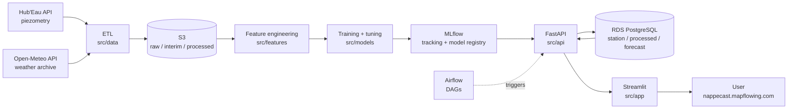
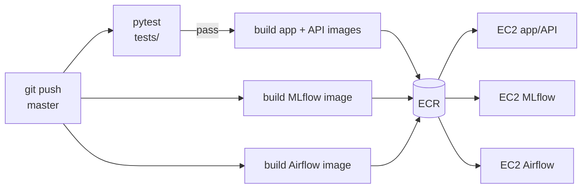
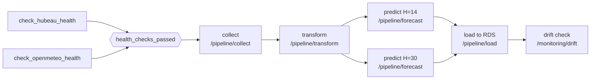
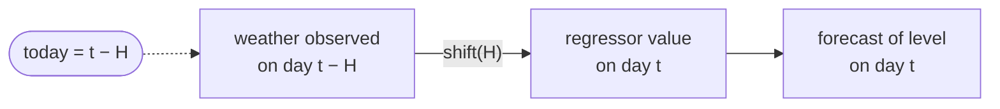
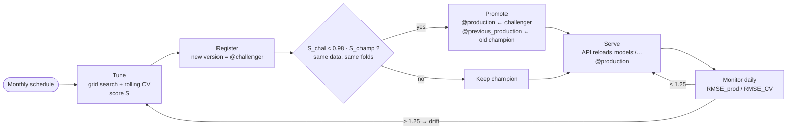

# NappeCast 💧

**Short-term groundwater-level forecasting from open piezometric and meteorological data.**

**Live demo:** https://nappecast.mapflowing.com/ · **Data:** [Hub'Eau](https://hubeau.eaufrance.fr/page/api-piezometrie) (piezometry) and [Open-Meteo](https://open-meteo.com/en/docs) (weather archive)

End-of-course project for the **Jedha "Architecte en Intelligence Artificielle"** certification (RNCP41993).

## Team

| Name | GitHub |
|---|---|
| Laura Domenech | [@lauradmch](https://github.com/lauradmch) |
| Ronan Guillou | [@RonanGuillou-hub](https://github.com/RonanGuillou-hub) |
| Adrien Cosson | [@Adrien-COSSON](https://github.com/Adrien-COSSON) |

---

## Abstract

**Context.** In France, groundwater supplies about two thirds of drinking water. Its management relies on empirical rules and administrative thresholds: prefectoral drought orders (*arrêtés sécheresse*) restrict water use when observed levels cross fixed alert levels (*vigilance, alerte, alerte renforcée, crise*). These rules are reactive: they trigger an intervention once the deficit is already measured. A short-term forecast of the water table would let water managers anticipate threshold crossings instead of observing them.

**Method.** We built an end-to-end forecasting pipeline for one piezometer, MILLAS C2-1 (Pyrénées-Orientales, *Alluvions quaternaires du Roussillon* aquifer), using nearly **10 years of daily data (2017 → 2026, ~3 500 observations)**. Weather data is turned into physically motivated features that encode aquifer memory (cumulative and effective precipitation over 30 and 90 days). A Prophet model with lagged weather regressors is trained per horizon (14 and 30 days), tuned by rolling-origin cross-validation with a custom score that penalises error growth over the horizon, and compared against an XGBoost baseline. The model runs in production on AWS with Airflow orchestration, an MLflow model registry, champion/challenger promotion and daily performance-drift monitoring.

**Key results.** At a 14-day horizon, Prophet reaches **RMSE = 0.72 m, MAE = 0.57 m, R² = 0.62**, i.e. RMSE/σ(y) = 0.64: it removes ~36 % of the error of a constant-mean predictor. Performance degrades gracefully at 30 days (RMSE = 0.82 m, R² = 0.53). Prophet beats XGBoost on RMSE and MAE.

**Conclusion.** Open data alone is enough to produce a useful 2-week groundwater forecast at a single station. The main limits are the absence of pumping data and the use of past weather instead of weather forecasts. Both are clear routes to improving the 30-day horizon and extending the approach to more stations.

---

## Table of contents

- [Results](#results)
- [Architecture](#architecture)
- [Repository structure](#repository-structure)
- [Data & feature engineering](#data--feature-engineering)
- [Modelling](#modelling)
- [MLOps](#mlops)
- [API reference](#api-reference)
- [Limitations & next steps](#limitations--next-steps)
- [References](#references)

---

## Results

**Target:** `niveau_nappe_eau`, the water-table elevation in metres NGF (French vertical datum) at station **MILLAS C2-1** (BSS `10906X0039/C2-1`).

**Series:** daily data from **2017-01-01 to 2026 (nearly 10 years, ~3 500 daily rows)** after alignment and interpolation. The level oscillates around ~104 m with a standard deviation of **1.12 m**, so a useful model must beat that number.

Prophet, rolling-origin cross-validation (initial window = 80 % of the series, new cutoff every 45 days), metrics averaged over the horizon:

| Horizon | RMSE (m) | MAE (m) | MAPE | R² | RMSE / σ(y) |
|---|---|---|---|---|---|
| **14 days** (retained) | **0.715** | 0.570 | 0.56 % | **0.617** | **0.64** |
| 30 days | 0.816 | 0.642 | 0.62 % | 0.527 | 0.73 |

`RMSE / σ(y) = 0.64` means the model removes ~36 % of the error made by always predicting the mean level. `MAE` means a typical error of **57 cm on a 104 m level (0.56 %)**.

Hyperparameters retained for H = 14 at time of writing: `changepoint_prior_scale=0.3`, `seasonality_prior_scale=0.1`, `changepoint_range=0.8`, additive seasonality, yearly only. Models are re-tuned monthly (see [MLOps](#mlops)), so the production values are the ones in the MLflow registry.

### Model selection: Prophet vs. XGBoost baseline

| | Prophet + lagged weather regressors | XGBoost regressor |
|---|---|---|
| RMSE (m) | **0.71** | 0.75 |
| MAE (m) | **0.57** | 0.68 |
| MAPE | **0.56 %** | 0.67 % |
| R² | **0.62** | −150.9 |
| Nature | additive decomposition, built for time series | gradient-boosted trees, no temporal structure |

R² is not a suitable metric for the XGBoost evaluation. R² divides the model error by the variance of the test window; on a 30-day holdout the water table barely moves, the denominator collapses, and any small systematic offset explodes the ratio. XGBoost's absolute error (68 cm) is in fact comparable to Prophet's. Prophet was selected on RMSE/MAE, on its handling of trend changepoints and yearly seasonality, and on its ability to carry weather regressors into the forecast window. It is also the model used in the reference literature for this task (Galdelli et al., 2025), which makes the comparison meaningful.

---

## Architecture

### Data flow



### AWS deployment (eu-west-3)

| Layer | Service | Role |
|---|---|---|
| Storage | **S3** (`nappecast`) | tabular data (raw / interim / processed / forecast), logs, MLflow artifacts |
| Database | **RDS PostgreSQL** | `station`, `processed` and `forecast` tables served to the app |
| Application | **EC2** | Docker Compose: Caddy (HTTPS) → Streamlit → FastAPI (`nappecast.mapflowing.com`) |
| Tracking | **EC2** | MLflow server + model registry, S3 artifact root (`mlflow.mapflowing.com`) |
| Orchestration | **EC2** | Airflow (`airflow.mapflowing.com`), DAGs synced from `s3://nappecast/airflow/dags/` |
| Images | **ECR** | Docker images built by CI/CD |
| Network | **VPC** | the 3 EC2 instances share one VPC; public traffic goes through Caddy over HTTPS |

### CI/CD



Three GitHub Actions workflows (`ci-app_api`, `cd-mlflow`, `cd-airflow`). AWS auth uses OIDC (no long-lived keys); SSH is opened only for the runner's IP during deployment, then closed.

### Airflow DAGs (`docker/airflow/dags/`)

| DAG | Schedule | Purpose |
|---|---|---|
| `nappecast_daily_predict` | daily, 06:00 | collect → transform → forecast H = 14 and H = 30 → load to RDS → drift check |
| `nappecast_monthly_retrain` | 1st of each month, 03:00 UTC | re-tune both horizons, champion/challenger promotion, smoke test |
| `nappecast_logs` | hourly | archive the current API log file to S3 with a timestamp |

The DAGs import no project code: each task calls an API endpoint, so training and serving share exactly one code path.

**Daily forecast** — `nappecast_daily_predict`



The two health checks run in parallel: if either source API is down, nothing downstream runs, so the app never shows a forecast built on stale data. The two horizons are predicted in parallel.

**Monthly retrain** — `nappecast_monthly_retrain`


Both `tune` tasks come from dynamic task mapping (`tune.expand(H=[14, 30])`) but share a 1-slot `training_pool`, so they run one after the other and never compete for the API's CPU. The API also returns `409` if a tuning is already running. Each `tune` call runs the full grid search, registration and champion/challenger decision described in [MLOps](#mlops).

---

## Repository structure

```
NappeCast-forecasting/
├── .github/workflows/           # CI (tests + app/API deploy), CD for MLflow and Airflow
├── configs/config.yaml          # non-secret config: APIs, paths, S3, model params, MLflow
├── data/                        # raw / interim / processed / forecast (git-ignored, mirrored to S3)
├── docker/
│   ├── airflow/                 # Airflow image, compose, DAGs
│   ├── app_api/                 # Caddy + Streamlit + FastAPI compose
│   └── mlflow/                  # MLflow server image + compose
├── docs/                        # deployment guides (EC2, IAM), metrics & monitoring slide
├── notebooks/                   # exploration & analysis (see below)
├── src/
│   ├── config.py                # single entry point: YAML + .env loading, cached
│   ├── data/                    # API calls, incremental backfill, cleaning, feature CLI
│   ├── features/                # rolling water-balance features + standardized indices
│   ├── models/
│   │   ├── prophet_predict.py   # train, backtest, log to MLflow
│   │   ├── prophet_tune.py      # horizon-wise grid search with a robustness-penalised score
│   │   ├── production.py        # champion/challenger promotion via MLflow aliases
│   │   └── xgboost_rg.py        # XGBoost baseline
│   ├── monitoring/drift.py      # performance-drift check (Evidently + MLflow)
│   ├── api/                     # FastAPI: pipeline, data, model and monitoring endpoints
│   ├── app/                     # Streamlit: Documentation / Data / Analysis / Predictions tabs
│   ├── sql/                     # RDS table definitions
│   └── helper/                  # S3/RDS I/O, SPLI and index computation, constants
├── tests/                       # pytest suite (data, features, indices, SPLI, models, production)
├── Makefile
└── requirements.txt
```

**Notebooks** (analysis narrative, in reading order):

| Notebook | Content |
|---|---|
| `eda_piezometer.ipynb` | raw piezometric data, quality flags |
| `temporal_analysis.ipynb` | trend / seasonality / noise, STL decomposition, construction and interpretation of the SPLI |
| `extreme_events_analysis.ipynb` | drought and heatwave detection by run theory, compound dry-hot events, rainfall → groundwater lag |
| `features_engineering.ipynb` | rolling water-balance features |
| `forecasting_analysis.ipynb` | Holt-Winters and ARIMA baselines, groundwork for future SARIMAX |
| `prophet_analysis.ipynb` | univariate Prophet → Prophet with lagged regressors, CCF-based feature selection |
| `machine_learning.ipynb` | XGBoost regressor, 30-day rolling evaluation, R² diagnosis |

---

## Data & feature engineering

**Sources.** Piezometric records exist since 2000 at MILLAS C2-1; the modelling window starts on **2017-01-01**, the start of the weather archive pull configured in `configs/config.yaml`. This gives nearly 10 years of daily data (~3 500 rows after alignment and interpolation).

**Cleaning.** Weather variables are dropped in two passes: columns with excessive missingness (UV index, visibility, snowfall, precipitation probability), then columns strongly collinear with a retained one (apparent temperatures, surface pressure, dew point, rain/showers vs. total precipitation).

**Physically motivated features.** Groundwater does not respond to yesterday's rain; it integrates it. The pipeline therefore encodes aquifer memory explicitly:

- `p_cum_30d`, `p_cum_90d`: cumulative precipitation
- `peff_cum_30d`, `peff_cum_90d`: cumulative effective precipitation (P − ET₀), i.e. the part of rainfall left for infiltration once reference evapotranspiration is removed
- `temperature_mean_30d`, `temperature_mean_90d`: mean soil temperature (0–100 cm)

**Standardized indices.** The pipeline also produces monthly indices on the same N(0,1) z-score scale, so they can be compared and overlaid directly. The main one is the **SPLI** (*Standardised Piezometric Level Index*), used by BRGM for groundwater management, alongside SPI (precipitation), SPEI (P − ET₀), SSMI (soil moisture) and others.

The SPLI is built by a **non-parametric normal-scores transform applied per calendar month**: rank the month's level against the same calendar month in every other year, convert the rank to a probability with the **Gringorten plotting position** `p = (i − 0.44) / (n + 0.12)`, then map it through the inverse normal CDF. *SPLI = 0 means the water table sits exactly at its historical median for that month; −1.5 means a severe deficit.* Unlike a plain z-score, it assumes nothing about the distribution of raw levels and compares each month only to its own calendar history.

**Leakage control.** Forward-filling a monthly index across its days would let early-January rows carry information from late-January measurements. The SPLI is therefore used in two roles: **retrospective** (each month's own aggregate) for descriptive analysis, and **shifted by one month** whenever it feeds a forecasting model.

---

## Modelling

**Model.** Prophet is Meta's additive decomposition model: it fits `target ≈ trend + seasonality + regressors + noise` as a function of time. It is curve-fitting on the calendar, not autoregressive: it never uses lagged values of the target itself.

Prophet needs its regressors to be known over the forecast window, so the pipeline shifts every weather feature forward by exactly the horizon H:

```python
df_ext[f"{col}_lag{H}"] = df_ext[col].shift(H)
```



Each forecast is therefore driven only by observations made at least H days earlier. The feature set changes with H, which is why the hyperparameter search is run independently for each horizon.

**Features** (selected by cross-correlation analysis, `prophet_analysis.ipynb`):

```
shortwave_radiation_sum · et0_fao_evapotranspiration · soil_temperature_0_to_100cm_mean
P_cum_90d · Peff_cum_90d · Temperature_mean_90d
```

**Validation.** Rolling-origin cross-validation (`prophet.diagnostics.cross_validation`): first cutoff after 80 % of the series, a new cutoff every 45 days, evaluation over the following H days. No shuffling anywhere: the split is strictly chronological.

```
2017 ───────────────────────────────────────────────────────────── 2026
fold 1  [■■■■■■■■■■■■■■■■■■■■■■■■■■■■ train (80 %) ■■■■■■■■■■]▓▓ H
fold 2  [■■■■■■■■■■■■■■■■■■■■■■■■■■■■ train ■■■■■■■■■■■■■■■■■■■]▓▓ H
fold 3  [■■■■■■■■■■■■■■■■■■■■■■■■■■■■ train ■■■■■■■■■■■■■■■■■■■■■■■■]▓▓ H
                                                cutoff every 45 days →
```

**Selection criterion.** Rather than picking the minimum RMSE, `prophet_tune.py` scores each configuration with

```
S = RMSE × (1 + 0.4 · max(0, D − 1)) × (1 + 0.3 · max(0, RMSE/MAE − 1))
D = RMSE(day H) / RMSE(day 1)
```

*D* penalises error growth across the horizon; *RMSE/MAE ≫ 1* penalises error distributions dominated by a few large misses. This favours configurations that are flexible without overfitting and that degrade gracefully with distance. The same score is reused to decide promotions in production.

---

## MLOps

Closed loop: **tune → promote → serve → monitor → retrain**.



- **Experiment tracking.** Every run logs parameters, metrics (RMSE, MAE, MAPE, R², σ(y), RMSE/σ, horizon degradation, 80 % interval coverage), figures and the serialized model to MLflow. Tuning nests one child run per grid configuration under a parent run per horizon.
- **Champion / challenger.** Each month the new best model is registered as `@challenger`; the current `@production` model is re-scored on the same data and folds. The challenger is promoted only if `S_challenger < 0.98 · S_champion` (≥ 2 % gain, so no swap for noise-level differences). The previous champion keeps a `@previous_production` alias: rollback is one alias swap, no redeploy.
- **Serving.** The API resolves `models:/<name>@production` and caches the model in-process; `/model/reload` picks up a promotion without redeploying.
- **Performance-drift monitoring.** Daily, after the forecast, past predictions are joined with the observed levels. Drift is flagged when `RMSE_prod / RMSE_CV > 1.25`. Each check produces an Evidently regression report (error by lead time) and an MLflow run, so production RMSE is tracked as a time series. An alert triggers an out-of-schedule retrain.
- **CI/CD.** Tests gate every deployment of the app/API; images are built to ECR and deployed on push to `master` (see [CI/CD](#cicd)).
- **Configuration split.** `configs/config.yaml` (versioned, non-secret) vs. `.env` (secrets, git-ignored). `src/config.py` loads both with `override=False`, so environment variables injected by Docker or CI always win.
- **Train/serve consistency.** Training, prediction and the Streamlit app share the same `TARGET`, feature list and lag logic, and Airflow triggers the API instead of re-implementing the pipeline.
- **Data lineage.** Every ETL stage writes to both the local `data/` tree and its S3 prefix (`raw/`, `interim/`, `processed/`, `forecast/`).

---

## API reference

Interactive docs at `/docs` (Swagger) once the API is running.

| Method | Endpoint | Description |
|---|---|---|
| `GET` | `/health` | liveness probe |
| `GET` | `/model/info` | state of the cached model (loaded, source, type, load time) |
| `POST` | `/model/reload` | reload the model from the registry after a promotion |
| `POST` | `/pipeline/collect` | fetch and clean new Hub'Eau and Open-Meteo data |
| `POST` | `/pipeline/transform` | run feature engineering on interim data |
| `POST` | `/pipeline/forecast` | predict from the latest processed data |
| `POST` | `/pipeline/tuning` | tune a horizon, register the model, run champion/challenger |
| `POST` | `/pipeline/load` | persist data and forecasts to RDS |
| `POST` | `/monitoring/drift` | run the performance-drift check |
| `POST` | `/data/station` · `/data/processed` · `/data/forecast` | read the corresponding RDS table |
| `POST` | `/data/transfert_log` | archive the log file to S3 |

---

## Limitations & next steps

- **Single station.** The pipeline is parameterised by a list of BSS codes, but it has been validated on one piezometer. Per-station models and pooled training are the natural extension.
- **Weather is observed, not forecast.** Regressors are past observations shifted forward: leakage-free, but it ignores the information in an actual weather forecast. Plugging the Open-Meteo *forecast* endpoint into the future rows should improve H = 14 and especially H = 30.
- **No abstraction data.** Pumping and irrigation withdrawals are a first-order driver of groundwater level and are absent from the model. They are the most likely source of unexplained variance.

**Roadmap:** SARIMAX with exogenous regressors as a complementary model · alerting on threshold crossings (SPLI ≤ −1.5), mapped to the French drought-order levels · station selection in the front end · admin panel.

---

## References

1. Galdelli, A. *et al.* (2025). *Groundwater Level Forecasting Using Data-Driven Models and Vadose Zone: A Comparative Analysis of ARIMA, SARIMAX, Prophet, and NeuralProphet.* **Applied Computing and Geosciences**, 27, 100262.
2. *Towards flexible groundwater-level prediction for adaptive water management: using Facebook's Prophet forecasting approach.*
3. BRGM — [Standardised Piezometric Level Indicator (SPLI) for water-resource management](https://www.brgm.fr/en/reference-completed-project/standardised-piezometric-level-indicator-spli-water-resource-management).

**Data:** Hub'Eau — Piezometry API (Eaufrance / BRGM) · Open-Meteo Historical Weather API.
