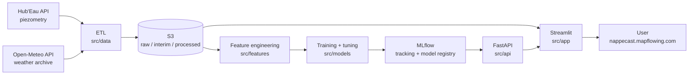

# NappeCast 💧

**Short-term groundwater-level forecasting from open piezometric and meteorological data.**

NappeCast turns data from open APIs into a daily forecast of water table level, served through a FastAPI backend and a Streamlit dashboard on AWS.
In France, aquifer recharge is currently piloted by empirical rules and administrative thresholds that often trigger an intervention after a deficit occurs. NappeCast aims to support groundwater recharge using forecasts.

**Data sources:** [Hub'Eau](https://hubeau.eaufrance.fr/page/api-piezometrie) (piezometry) and [Open-Meteo](https://open-meteo.com/en/docs) (weather archive)

**Live demo:** https://nappecast.mapflowing.com/

This is an end-of-course project for the **Jedha "Architecte en Intelligence Artificielle"** certification (RNCP41993)

---

## Table of contents

- [Results](#results)
- [Architecture](#architecture)
- [Repository structure](#repository-structure)
- [Data & feature engineering](#data--feature-engineering)
- [Modelling](#modelling)
- [API reference](#api-reference)
- [MLOps](#mlops)
- [Limitations & next steps](#limitations--next-steps)
- [References](#references)

---

## Results

Target: `niveau_nappe_eau`, the water-table elevation in metres NGF (French vertical datum) at station **MILLAS C2-1** (BSS `10906X0039/C2-1`, Pyrénées-Orientales), in the *Alluvions quaternaires du Roussillon* aquifer. The series oscillates around ~104 m with a standard deviation of **1.12 m**, so a useful model must beat that number.

Prophet, rolling-origin cross-validation (initial = 80 % of the series, new cutoff every 45 days), metrics averaged across the horizon:

| Horizon | RMSE (m) | MAE (m) | MAPE | R² | RMSE / σ(y) |
|---|---|---|---|---|---|
| **14 days** (retained) | **0.715** | 0.570 | 0.56 % | **0.617** | **0.64** |
| 30 days | 0.816 | 0.642 | 0.62 % | 0.527 | 0.73 |

`RMSE / σ(y) = 0.64` means the model removes ~36 % of the error made by always predicting the seasonal-climatological mean. `MAE` indicates a typical error of **57 cm on a 104 m level (0.56 %)**.

Retained hyperparameters (H = 14): `changepoint_prior_scale=0.3`, `seasonality_prior_scale=0.1`, `changepoint_range=0.8`, additive seasonality, yearly only.

### Model selection: comparing Prophet with an XGBoost baseline

| | Prophet + lagged weather regressors | XGBoost regressor |
|---|---|---|
| RMSE (m) | **0.71** | 0.75 |
| MAE (m) | **0.57** | 0.68 |
| MAPE | 0.56 % | 0.67 % |
| R² | 0.62 | **−150.9** |
| Nature | additive decomposition, built for time series | gradient boosting on trees, no temporal structure |

R² is not a suitable metric for the XGBoost model. R² divides the model error by the variance of the test window; on a 30-day holdout the water table barely moves, the denominator collapses, and any small systematic offset explodes the ratio. XGBoost's absolute error (68 cm) is in fact comparable to Prophet's. The model was selected based on RMSE/MAE, on Prophet's handling of trend changepoints and yearly seasonality, and on its ability to carry weather regressors into the forecast window.

Prophet was also the model of choice in the reference literature for this task (Galdelli et al., 2025), which makes the comparison meaningful.

---

## Architecture

### Data flow



### AWS deployment

| Layer | Service | Role |
|---|---|---|
| Storage | **S3** (`nappecast`) | tabular data (raw / interim / processed) + MLflow artifacts |
| Application | **EC2 #1** (`t3.small`) | Docker Compose: Caddy (HTTPS) → Streamlit → FastAPI |
| Tracking | **EC2 #2** (`t3.micro`) | MLflow server, SQLite backend store, S3 artifact root |
| Ingestion | **Lambda** | scheduled collection of new piezometric and weather records |
| Orchestration | **EventBridge** | training triggers, EC2 shutdown windows, budget control |
| Observability | **CloudWatch** | centralised logs |
| Network | **VPC** | private subnets, HTTPS routing via Caddy |

---

## Repository structure

```
NappeCast-forecasting/
├── configs/
│   └── config.yaml              # non-secret config: APIs, paths, S3, model params, MLflow
├── data/                        # raw / interim / processed / external (git-ignored, mirrored to S3)
├── notebooks/                   # exploration & analysis (see below)
├── src/
│   ├── config.py                # single entry point: YAML + .env loading, cached
│   ├── data/
│   │   ├── make_dataset.py      # API calls, incremental backfill, merge  → data/interim
│   │   ├── clean_dataset.py     # column selection, correlation-based drops
│   │   └── feat_dataset.py      # CLI wrapper for the feature pipeline
│   ├── features/
│   │   └── features_engineering.py   # rolling water-balance features + standardized indices
│   ├── models/
│   │   ├── preprocessing.py     # feature selection + chronological train/test split
│   │   ├── prophet_predict.py   # train, backtest, log to MLflow
│   │   ├── prophet_tune.py      # horizon-wise grid search with a robustness-penalised score
│   │   └── xgboost_rg.py        # XGBoost baseline
│   ├── api/                     # FastAPI: model loading (local | MLflow registry), health, compare
│   ├── app/                     # Streamlit: Documentation / Data / Analysis / Predictions tabs
│   ├── helper/                  # S3 I/O and date helpers
│   └── mlflow/                  # MLflow server image + compose
├── tests/
├── docker-compose.yml           # Caddy + Streamlit + FastAPI
├── Caddyfile
├── Makefile
└── requirements.txt
```

**Notebooks** (analysis narrative, in reading order):

| Notebook | Content |
|---|---|
| `eda_piezometer.ipynb` | raw piezometric data, quality flags |
| `temporal_analysis.ipynb` | trend / seasonality / noise, STL decomposition, construction and interpretation of the SPLI |
| `extreme_events_analysis.ipynb` | drought and heatwave detection by run theory, compound dry-hot events, rainfall → groundwater lag |
| `features_engineering.ipynb` | rolling water-balance features |
| `forecasting_analysis.ipynb` | Holt-Winters and ARIMA baselines exploration, for futur work with SARIMAX |
| `prophet_analysis.ipynb` | univariate Prophet → Prophet with lagged regressors, CCF-based feature selection |
| `machine_learning.ipynb` | XGBoost regressor, 30-day rolling evaluation, R² diagnosis |

---

## Data & feature engineering

**Sources.** Piezometric records exist since 2000 at MILLAS C2-1; the modelling window starts **2017-01-01**, the start date of the weather archive pull configured in `configs/config.yaml`. After daily alignment and interpolation: **~3 490 daily rows**.

**Cleaning.** Weather variables are selected in two passes: columns with excessive missingness (UV index, visibility, snowfall, precipitation probability) and columns strongly collinear with a retained one (apparent temperatures, surface pressure, dew point, rain/showers vs. total precipitation).

**Physically motivated features.** Groundwater does not respond to yesterday's rain; it integrates it. The pipeline therefore encodes aquifer memory explicitly:

- `P_cum_30d`, `P_cum_90d`: cumulative precipitation
- `Peff_cum_30d`, `Peff_cum_90d`: cumulative effective precipitation (P − ET₀), i.e. the fraction of rainfall actually available for infiltration once reference evapotranspiration is removed
- `Temperature_mean_30d`, `Temperature_mean_90d`: mean soil temperature (0–100 cm)

**Standardized indices.** The pipeline also produces a set of monthly indices, all on the same N(0,1) z-score scale and therefore directly comparable and overlayable. The main indicator is the **SPLI** (*Standardised Piezometric Level Index*), used by BRGM for groundwater-resource management, plus SPI (precipitation), SPEI (P − ET₀), SSMI (soil moisture) and others.

The SPLI is built by a **non-parametric normal-scores transform applied per calendar month**: rank the month's level against every other year's value for that same calendar month, convert the rank to a probability with the **Gringorten plotting position** `p = (i − 0.44) / (n + 0.12)`, then map it through the inverse normal CDF. *SPLI = 0 means this month's water table sits exactly at its historical median for that month; −1.5 means a severe deficit.* Unlike a plain z-score, it makes no normality assumption about the raw levels and compares each month only to its own calendar history.

**Leakage control.** Forward-filling a monthly index across its days would let early-January rows carry information from late-January measurements. The SPLI is therefore used in two distinct roles: **retrospective** (each month's own aggregate) for descriptive analysis and figures, and **shifted by one month** whenever it feeds a forecasting model.

---

## Modelling

**Model.** Prophet is a Meta's additive decomposition model, which fits `target ≈ trend + seasonality + regressors + noise` as a function of time. It is curve-fitting on the calendar, not autoregressive: it never uses lagged values of the target itself.
Prophet needs its regressors to be known over the forecast window so the pipeline shifts every weather feature forward by exactly the horizon H:

```python
df_ext[f"{col}_lag{H}"] = df_ext[col].shift(H)
```

At prediction time each forecast is driven only by observations already made H days earlier. This means the feature set changes with H, which is why the hyperparameter search is repeated independently for each horizon.

**Features fed to the model** (selected via cross-correlation analysis, `prophet_analysis.ipynb`):

```
shortwave_radiation_sum · et0_fao_evapotranspiration · soil_temperature_0_to_100cm_mean
P_cum_90d · Peff_cum_90d · Temperature_mean_90d
```

**Validation.** Rolling-origin cross-validation (`prophet.diagnostics.cross_validation`): first cutoff after 80 % of the series, a new cutoff every 45 days, evaluation over the H days that follow. No random shuffling anywhere so the split is strictly chronological.

**Selection criterion.** Rather than picking the minimum RMSE, `prophet_tune.py` scores each configuration with

```
score = rmse × (1 + λ_deg · degradation) × (1 + λ_spread · rmse_mae)
```

where *degradation* is the growth of RMSE from the first to the last day of the horizon and *rmse/mae* flags error distributions dominated by a few large misses. This surfaces configurations that are flexible but not overfit, and that degrade gracefully with distance.

---

## API reference

| Method | Endpoint | Description |
|---|---|---|
| `GET` | `/health` | liveness probe |
| `GET` | `/data` | triggers an incremental dataset build, returns stations + processed data as JSON |
| `GET` | `/model/info` | cache state of the active model (loaded, source, type, load timestamp) |
| `GET` | `/model/info/all` | same, for every registered model |
| `POST` | `/model/reload` | forces a reload from the registry, used after a new training run |
| `GET` | `/compare` | end-of-month prediction from each registered model, side by side |

Interactive docs at `/docs` (Swagger) once the API is running.

---

## MLOps

- **Configuration split.** `configs/config.yaml` (versioned, non-secret) vs. `.env` (secrets, git-ignored). `src/config.py` loads both with `override=False`, so real environment variables injected by Docker or CI always win over the local `.env`.
- **Experiment tracking.** Every training run logs parameters, metrics (RMSE, MAE, MAPE, R², σ(y), RMSE/σ ratio, horizon degradation), figures and the serialized model to MLflow. The tuning script nests one child run per grid configuration under a parent run per horizon.
- **Model registry.** Models are promoted by **alias** (`production`), and the API resolves `models:/<name>@production` at load time, so a promotion in MLflow takes effect on the next `/model/reload`, with no redeploy.
- **Pluggable model source.** `api.model_source` switches between `local` (joblib files under `models/`) and `mlflow`, with an in-process cache so the model is downloaded once per container.
- **Train/serve consistency.** The Streamlit prediction tab re-imports the exact `TARGET`, `DAILY_FEATURES` and lag logic used at training time, guarding against train/serve skew.
- **Data lineage.** Every ETL stage writes to both the local `data/` tree and its S3 prefix (`raw/`, `interim/`, `processed/`), optionally timestamped.

---

## Limitations & next steps

**Current scope**

- **Single station.** The pipeline is parameterised by a list of BSS codes, but everything has been validated on one piezometer (MILLAS C2-1). Per-station model registry and pooled training are the natural extension.
- **Weather is assumed, not forecast.** Regressors are past observations shifted forward, which is leakage-free but discards the information in an actual meteorological forecast. Plugging the Open-Meteo *forecast* endpoint into the future rows should improve H = 14 and, especially, H = 30.
- **No abstraction data.** Pumping and irrigation withdrawals are a first-order driver of groundwater level and are absent from the model. Their omission is the most likely source of unexplained residual variance.
- **Test suite.** Unit tests on the feature pipeline and split logic are the priority.
- **No CI/CD.** Training, image builds and deployment are manual. GitHub Actions with a scheduled retraining job (continuous training) is the intended next step.

**Roadmap**: SARIMAX with exogenous regressors as a complementary model · automated retraining and drift monitoring · alerting on threshold crossings (SPLI ≤ −1.5) · station selection in the front end · admin panel.

---

## References

1. Galdelli, A. *et al.* (2025). *Groundwater Level Forecasting Using Data-Driven Models and Vadose Zone: A Comparative Analysis of ARIMA, SARIMAX, Prophet, and NeuralProphet.* **Applied Computing and Geosciences**, 27, 100262.
2. *Towards flexible groundwater-level prediction for adaptive water management: using Facebook's Prophet forecasting approach.*
3. BRGM — [Standardised Piezometric Level Indicator (SPLI) for water-resource management](https://www.brgm.fr/en/reference-completed-project/standardised-piezometric-level-indicator-spli-water-resource-management).

**Data:** Hub'Eau — Piezometry API (Eaufrance / BRGM) · Open-Meteo Historical Weather API.